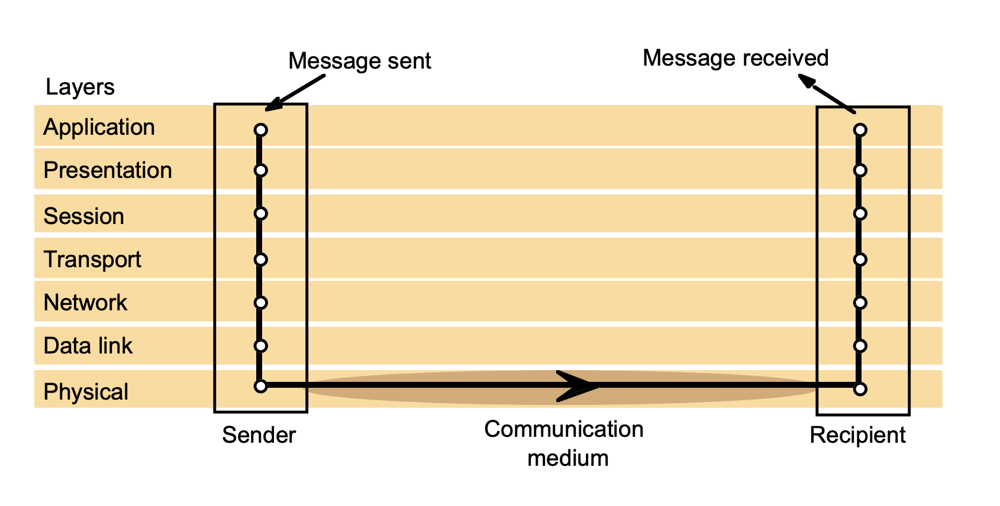
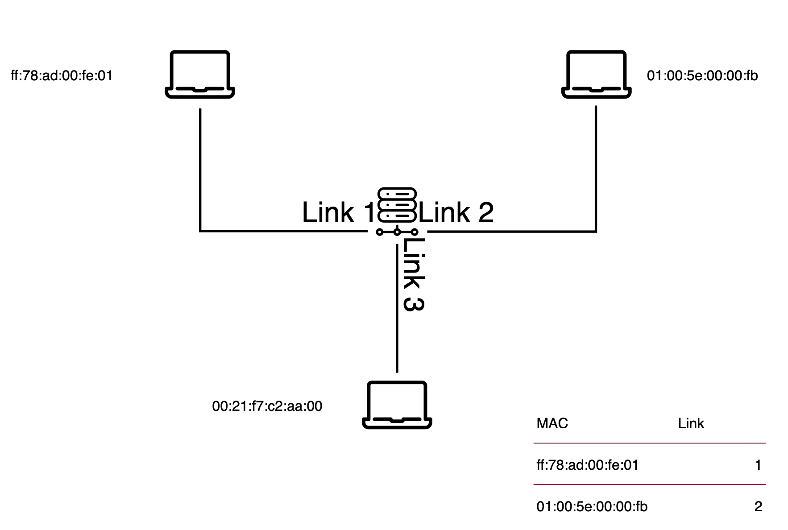
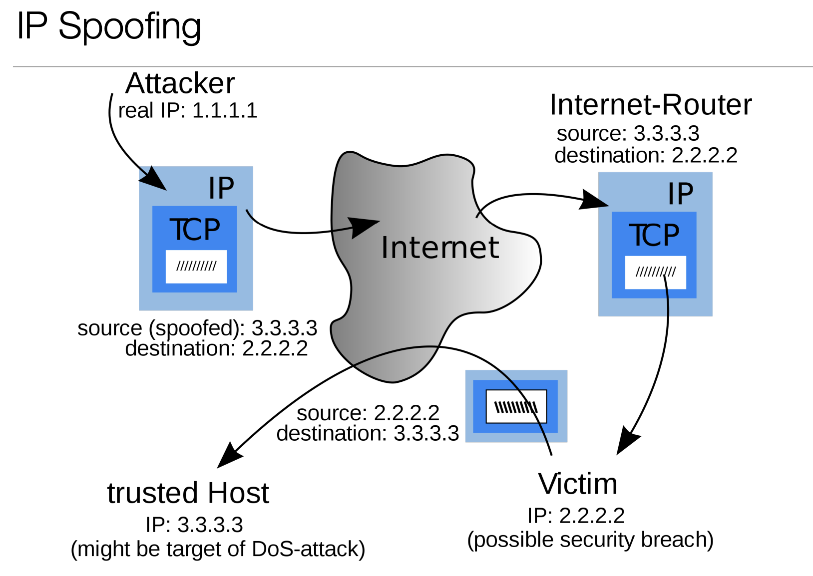
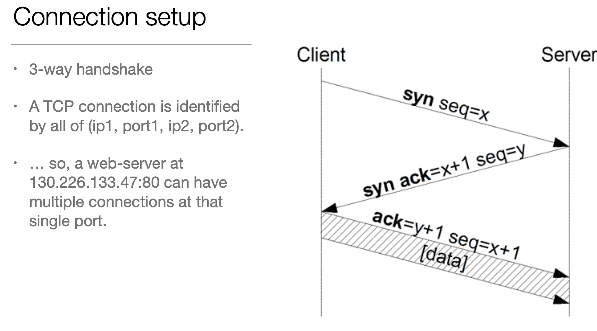
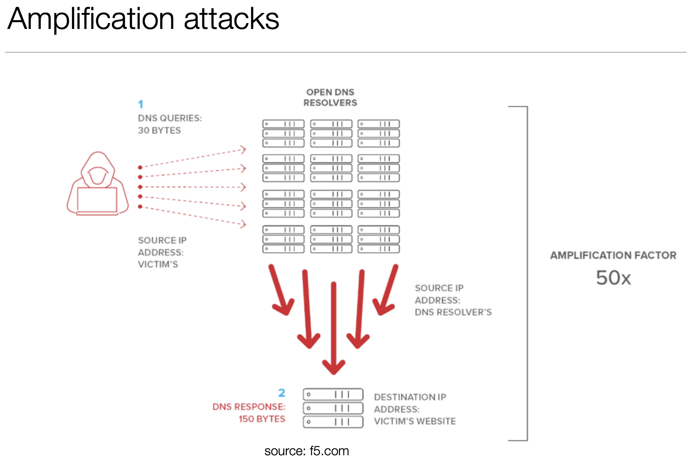

<h1>Network security</h1>

**Security goals**:

* Confidentiality: “Prevent unauthorised access to information.”
* Integrity: “Prevent unauthorised altering of information.”
* Availability: “Ensure the availability of the system for authorised uses.”

**Adversary capabilities (Dolev-Yao model)** :
* The adversary has complete control of the network. He may:
    * intercept messages
    * replay messages
    * transform message
    * insert messages
    * delete messages

**The physical layer**:
* Responsibility: Transmission of binary data across a physical link
* Usually broadcast (e.g., IEEE 802.3 Ethernet)
* Interconnection via hub
* Usually provides no guarantees.

**The data-link layer**:
* Responsibility: Transmission of packets between hosts connected by a physical link
* Solves addressing: Media Access Control (MAC) addresses
* Solves (partly) reliability: Checksums (e.g., IEEE 802.3 use of CRC)
* Performance gains by using switches rather than hubs

**MAC flooding attack**:
* Transmit enough fake frames with new src addresses that the switches’ table contains no actual addresses
* Switch must now broadcast all frames

**Network layer**:
* IP protocol (IPv4).
* Hosts identified by IP addresses.
* Best-effort (unreliable) delivery.
* May introduce packet duplication, out-of-order delivery.

**IP operation attacks**:
* Spoofing
    * ARP cache poisoning/spoofing: Spoof ARP “is” packets redirecting traffic for other IP to my machine.
    * IP spoofing.
    

    * DHCP starvation.

**Local denial-of-service attacks**:
* ARP Cache poisoning.
* DHCP Starvation.

**Remote denial-of-service attacks**:
* Ping flooding.
* IP fragmentation attack.
* Distribute the attack from many attacking machines formaximum effect.

**Transport layer(Transmission Control Protocol (TCP))**:
* Connection-oriented, reliable, streaming protocol.
* Achieved by message/acknowledgment sequence numbers, timeouts.
* Protocol specified as a fairly complex state machine.
* Also: Flow control, congestion control.

**TCP sequence prediction attack**:
* Suppose we want to hi-jack a connection from host A to B.
* TCP Sequence numbers are sent in cleartext (eavesdropping)
* Listen to traffic from B. Kill B’s end of the connection (e.g., next slide)
* Spoof TCP packets to A.

**TCP RESET attack**:
* Spoof TCP packet with RST set to 1.
* Remote system should drop connection
* Bypassing IDS/Firewall may require sequence prediction.

**TCP SYN flood**:
* Send large volumes of initial SYN message
* Very cheap
* Ties up buffers at receiving end

**Amplification attacks**:
* Generate more than one reply for each spoofed request
* DNS request “any” : 30 bytes
* DNS response to “any”: 150 bytes
* Amplification factor: 50x

         

**Defenses**:
* Cannot be prevented completely: Legitimate traffic; The Slashdot effect.
* DNS Reflection: Firewall may block replies to requests I didn’t send
* Amplification via IP broadcast: Firewall blocks broadcasts from outside local network
* RFC 2827. Block IP-spoofing at earliest point—local ISP knows if originator IP is legit or not.
* SYN-cookies vs. SYN-spoofing: encode all necessary state in SYN-ACK sequence number(!)
* Vs. Application-resources: CAPTCHAs.